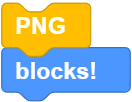
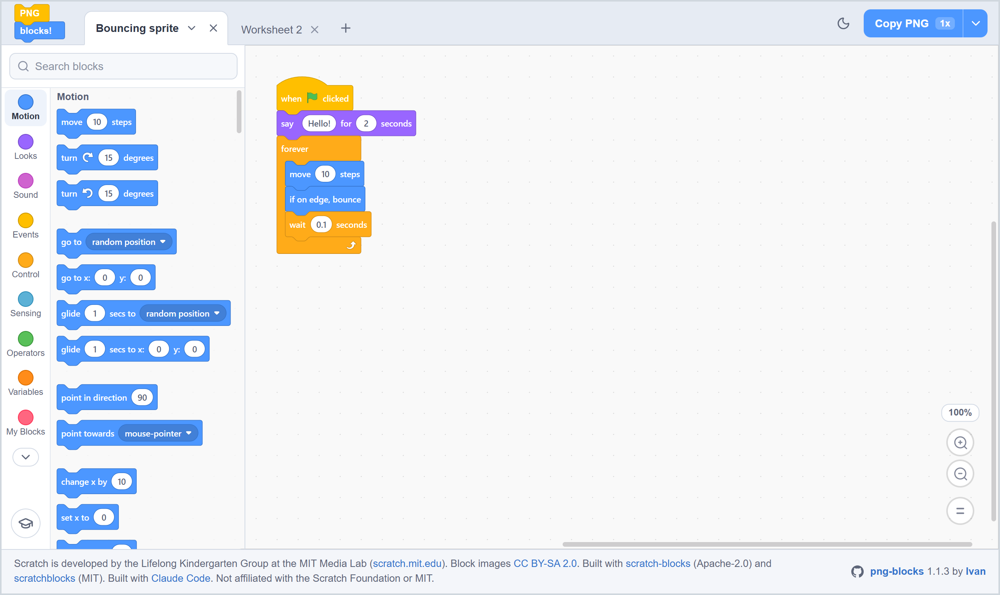
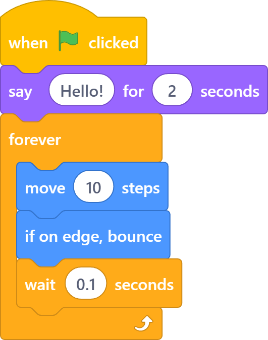
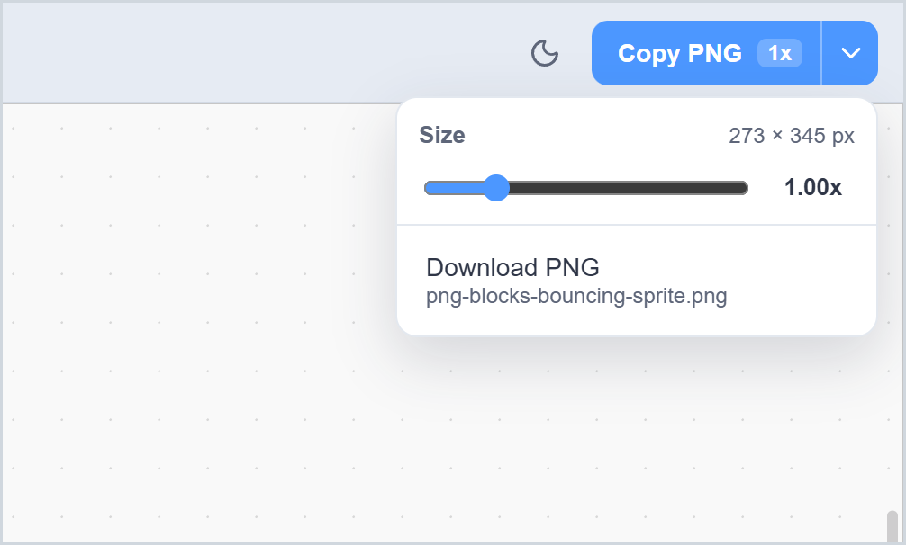
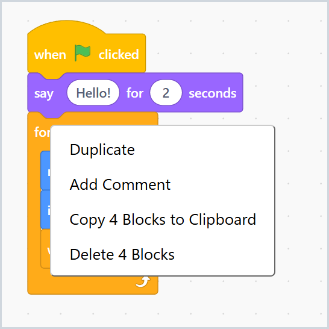
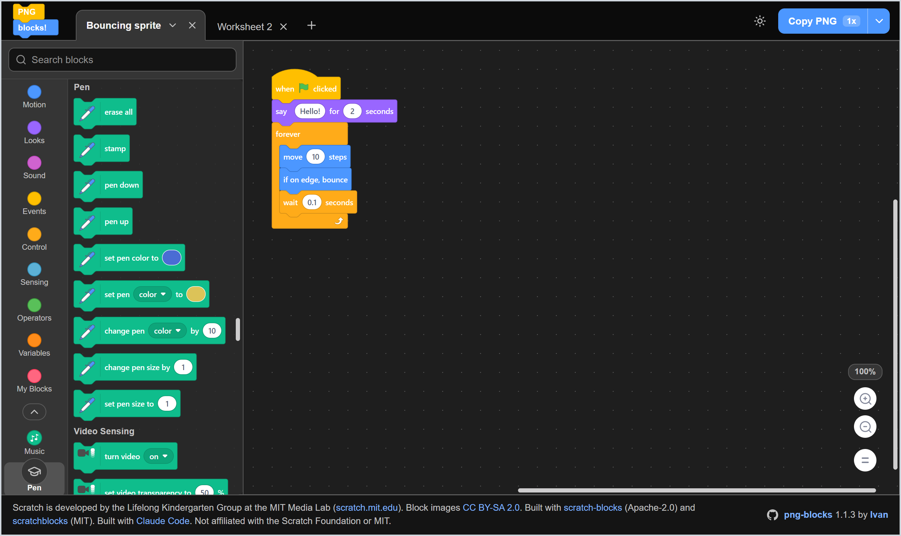

#  PNG blocks!

Clean pictures of Scratch code, ready for your slides and worksheets.

Snap Scratch 3 blocks together exactly as you would in Scratch, then copy them to your clipboard as a transparent PNG trimmed to the blocks. Paste straight into Google Slides, PowerPoint, Word or Docs. No screenshots, no cropping, no stray backgrounds.

**[Open PNG blocks!](https://pngblocks.netlify.app)** It runs in your browser, with nothing to install or sign up for.

## What you get

Build a script, press **Copy PNG**, and this lands on your clipboard:

The background is transparent and the edges are trimmed tight to the blocks, so the picture sits cleanly on any slide colour.

## Size it for the job

Open the menu next to **Copy PNG** to set the size from 0.25x to 4x. The menu shows the exact pixel size before you copy. Go small for an inline worksheet snippet, or large for a projector. Prefer a file? **Download PNG** saves it, named after your tab.

## Copy just one piece

Right-click any block and choose **Copy Block to Clipboard** to grab that block and everything under it, without the rest of the canvas. Handy for explaining a script one step at a time.

## Features

- **Every block.** All nine Scratch 3 categories, from Motion to My Blocks, with the same shapes, colours and dropdowns as the real editor.
- **Extensions.** Open the chevron under the categories for Music, Pen, Video Sensing, Text to Speech, Translate, Face Sensing, Makey Makey, micro:bit, LEGO MINDSTORMS EV3, LEGO WeDo 2.0, Force and Acceleration, and LEGO BOOST.
- **Search.** Type in **Search blocks** to find a block by its words, like "costume" or "broadcast".
- **Edit anything.** Type into inputs, pick dropdown values, add comments, and define your own blocks.
- **Tabs.** Keep one tab per lesson or worksheet. Rename, duplicate, clear or close them from the tab menu. Your tabs are saved in your browser, so they are still there next time.
- **Dark mode.** Switch with the moon button in the top bar. Exported PNGs look the same in either mode.
- **Tutorial.** A short guided tour plays on your first visit. Replay it any time with the graduation cap button.

## Crediting Scratch

Images of Scratch blocks are licensed under [CC BY-SA 2.0](https://creativecommons.org/licenses/by-sa/2.0/), so the PNGs you make here need the same credit when you share them. Something like this works:

> Scratch blocks from Scratch, developed by the Lifelong Kindergarten Group at the MIT Media Lab. See https://scratch.mit.edu. Licensed under CC BY-SA 2.0.

## Acknowledgements

- Scratch is developed by the Lifelong Kindergarten Group at the MIT Media Lab. See https://scratch.mit.edu.
- The block editor is [scratch-blocks](https://github.com/scratchfoundation/scratch-blocks) (Apache-2.0, Scratch Foundation).
- Extension blocks and some extension icons come from [scratchblocks](https://github.com/scratchblocks/scratchblocks) (MIT, Tim Radvan and contributors). See [THIRD_PARTY_NOTICES.md](THIRD_PARTY_NOTICES.md).
- PNG blocks! was built with [Claude Code](https://claude.com/claude-code).

PNG blocks! is not affiliated with the Scratch Foundation or MIT. Scratch is a trademark of the Scratch Foundation.

## Licence

MIT. See [LICENSE](LICENSE).
